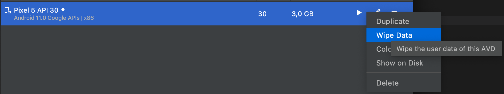

# mee-react-native-smartwallet

## Set Up Your Environment

- [React Native Environment Setup](https://reactnative.dev/docs/set-up-your-environment)
- Run `yarn install`

### To run the iOS application:

1. Open Xcode
2. Click **"Open Existing Project"**
3. Open `mee-react-native-smartwallet/ios`
4. Select an emulator
5. Click **"Start the active scheme"** (Play Icon)
6. After the emulator starts, run the following in the console:
   ```sh
   yarn start
   ```
   Then press **"i"** for iOS or run:
   ```sh
   yarn ios
   ```

### To run the Android application:

1. Open Android Studio
2. Click **"More Actions"** -> **"Virtual Device Manager"**
3. Select an emulator or click **"Create Virtual Device"** (Plus Icon)
4. Start the emulator
5. Once the emulator has started, go to **"Security & Privacy"** and add **Device Unlock**
6. Run the following in the console:

   ```sh
   yarn start
   ```

   Then press **"a"** for Android or run:

   ```sh
   yarn android

   ```

### To download generated ts/native RUST library from company's github:

1. Create and configure .npmrc like in the .npmrc.example
2. Get your token from your github account where you have access to the repo
3. Set the following permissions for this token:
   ✅ repo (for private repositories)
   ✅ read:packages (if it's a GitHub Package)
4. As advice, do not create token that lives forever
5. Add it to .npmrc
6. yarn upgrade mee-rust

### Android build problems:

If you run into android build problem with MainActivity class or cleaning cache and builds didn't help you,
you can try "wipe data" in your Android emulator.

